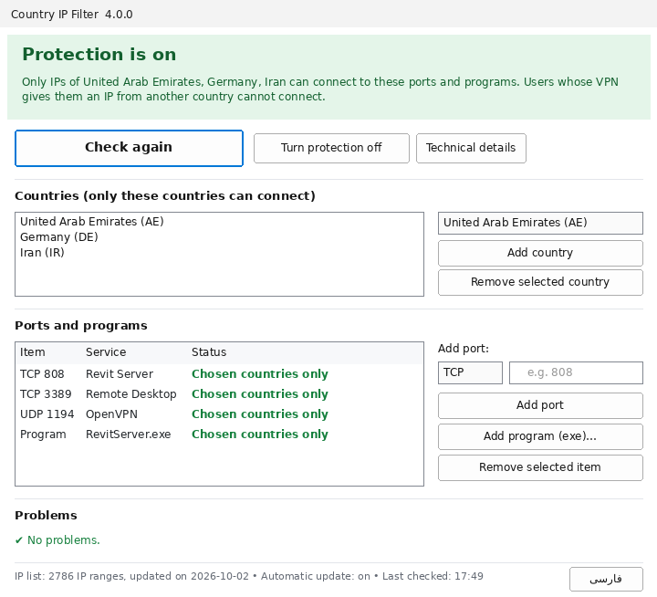
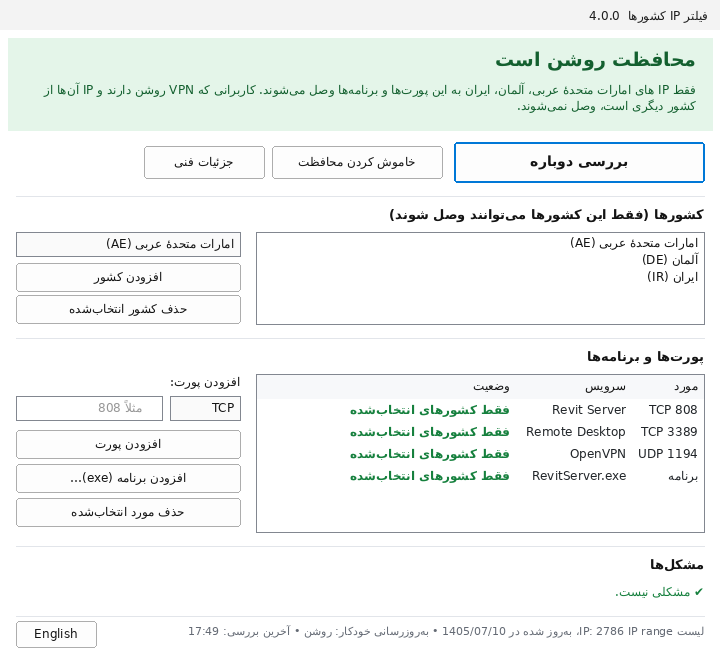

# Country IP Filter





A small Windows tool that makes chosen **TCP ports, UDP ports or programs** of a server reachable **only from the IPv4 addresses of the countries you choose**, using Windows Firewall. No installation and no command line: everything is done in one window, in **English or Persian** (one button switches).

Typical use: a server whose users are all in one or a few countries (a Revit Server, a database, Remote Desktop, a web app, a VPN), and nobody else should be able to reach it.

## Features

- **Any country, or several at once.** Pick them from a list of all countries.
- **Ports and programs.** Add a TCP or UDP port by number, pick one from a list of well-known services (Remote Desktop, SSH, web, SQL Server, Oracle, MySQL, PostgreSQL, OpenVPN, WireGuard, Revit Server …), or add a program (`.exe`): that program is then reachable from the chosen countries on every port it uses.
- **Clear state.** A colored banner and a table show, for each port or program, whether it is open only to the chosen countries, still open to everyone, or closed. Every problem comes with the one button that fixes it.
- **Old rules are handled.** Existing Windows Firewall rules that open the same ports to everyone are found and switched off (and switched back on when you turn protection off). Rules that could also cut Remote Desktop or SSH are never switched off without asking.
- **Monthly update.** The country lists are refreshed every 4 weeks by a Scheduled Task that runs only PowerShell (it does not need the program file). A new list that is much smaller, much bigger or broken is refused, and the reason is shown.
- **Safe to move.** All settings that matter are stored inside the firewall rules themselves; next to the program there is only a `data` folder.

## How it works

1. The IPv4 ranges of each chosen country are downloaded from [RIPEstat](https://stat.ripe.net/docs/data_api#country-resource-list) (data from all five regional internet registries).
2. The ranges are merged into as few networks as possible.
3. Allow rules are written to Windows Firewall, 400 ranges per rule: one set for the TCP ports, one for the UDP ports, and one for each program.
4. Rules that open the same ports to everyone are switched off, and the program remembers them.
5. "Turn protection off" removes its rules and switches the old rules back on.

## Use

1. Download the zip from Releases.
2. Unpack the folder inside it to:

```
C:\Program Files\CountryIPFilter
```

3. Double-click:

```
CountryIPFilter.exe
```

4. Answer Yes to the Windows prompt.
5. Under "Countries", choose a country and press "Add country".
6. Under "Ports and programs", type a port (or pick one from the list) and press "Add port".
7. Press the big "Turn protection on" button, read the message and press Yes.
8. If the banner does not turn green, press the big "Fix problems" button.

`Guide.html` next to the program has more details.

## Important

- Users whose VPN gives them an IP of another country cannot connect.
- Only IPv4 is let in; IPv6 connections from outside stay blocked.
- If you manage the server with Remote Desktop from another country, do not add port 3389 (the program warns you).
- Try it on a test server first.

## Upgrading from Iran IP Filter 3.x

Version 4 finds the rules and the monthly task of version 3 and moves them over by itself (same ports, Iran, same records). Nothing changes for the users. Afterwards delete the old `IranIPFilter.exe`.

## Requirements

- Windows Server 2016 or newer, or Windows 10/11 (Windows Server 2012 R2 needs WMF 5.1)
- Windows PowerShell 5.1
- Administrator rights

## Build

Go 1.24 and Python 3. No outside libraries.

```
./build.sh 4.0.0
```

This runs `go vet` (also for Windows), the tests, builds the resource file (icon, manifest, version) and writes `dist/CountryIPFilter.exe` with the guides next to it.

The tests run on any system: Windows Firewall is simulated. When PowerShell 7 (`pwsh`) is installed, the generated PowerShell scripts are also parsed and run against fake firewall cmdlets.

```
go test ./...
```

## Code

| File | What it does |
|---|---|
| `core.go` | ports/programs/countries, the country lists, merging ranges, operations |
| `scripts.go` | the PowerShell scripts (rules, status, monthly update) |
| `status.go` | reading the firewall state, deciding which rules matter |
| `view.go` | turning the state into what the window shows |
| `app.go` | what each button does |
| `layout.go`, `gui_windows.go` | the window (Win32) |
| `sys_windows.go` | running PowerShell, folder permissions |
| `i18n.go`, `countries.go`, `ports.go` | English texts, country names, well-known ports |
| `*_test.go` | tests, the fake firewall, PowerShell checks |

## License

MIT, see LICENSE.

---

<div dir="rtl">

## فارسی

این برنامه روی یک سرور ویندوزی، پورت‌ها یا برنامه‌هایی را که انتخاب می‌کنید فقط برای IP های کشورهایی که انتخاب می‌کنید باز می‌کند. بقیه‌ی دنیا نمی‌توانند وصل شوند.

- نصب لازم ندارد؛ فقط یک فایل exe است.
- همه‌ی کارها از داخل پنجره‌ی برنامه انجام می‌شود و لازم نیست دستوری تایپ کنید.
- یک یا چند کشور را می‌شود با هم انتخاب کرد.
- پورت TCP، پورت UDP یا یک برنامه (فایل exe) را می‌شود اضافه کرد. یک لیست از پورت‌های معروف هم دارد.
- لیست IP کشورها هر 4 هفته یک بار خودکار به‌روز می‌شود.
- فارسی و انگلیسی دارد. با دکمه‌ی پایین پنجره زبان عوض می‌شود.

### استفاده

1. پوشه‌ی داخل فایل zip را بیرون بکشید و در این مسیر بگذارید:

```
C:\Program Files\CountryIPFilter
```

2. روی این فایل دوبار کلیک کنید:

```
CountryIPFilter.exe
```

3. در پیام ویندوز، Yes را بزنید.
4. در بخش «کشورها»، کشور را از لیست انتخاب کنید.
5. دکمه‌ی «افزودن کشور» را بزنید.
6. در بخش «پورت‌ها و برنامه‌ها»، شماره‌ی پورت را بنویسید یا از لیست انتخاب کنید.
7. دکمه‌ی «افزودن پورت» را بزنید.
8. دکمه‌ی بزرگ «روشن کردن محافظت» را بزنید.
9. متن پیام را بخوانید و Yes را بزنید.
10. اگر رنگ کادر بالا سبز نشد، دکمه‌ی بزرگ «درست کردن مشکل‌ها» را بزنید.

راهنمای کامل‌تر در فایل Guide-fa.html کنار برنامه است.

### اگر نسخه‌ی قدیمی (Iran IP Filter) روی سرور روشن است

نسخه‌ی جدید Rule ها و به‌روزرسانی خودکار نسخه‌ی قدیمی را خودش به نسخه‌ی جدید منتقل می‌کند. چیزی برای کاربران عوض نمی‌شود. بعد از آن فایل قدیمی را پاک کنید:

```
IranIPFilter.exe
```

</div>
